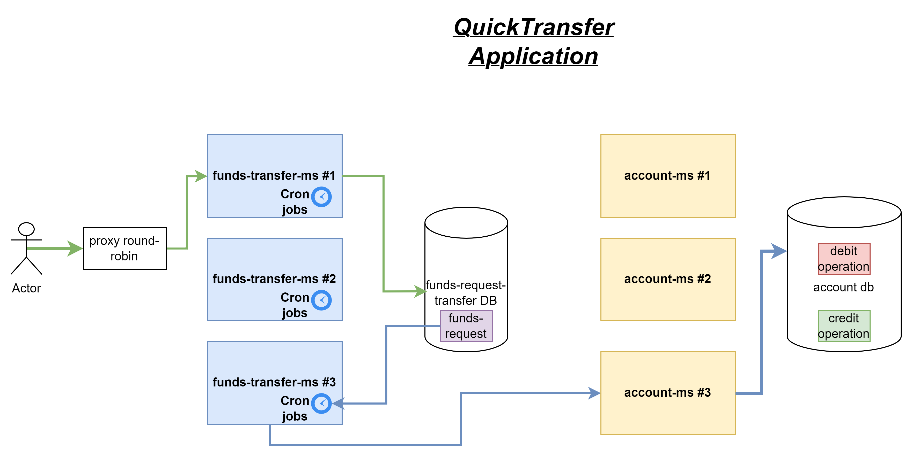
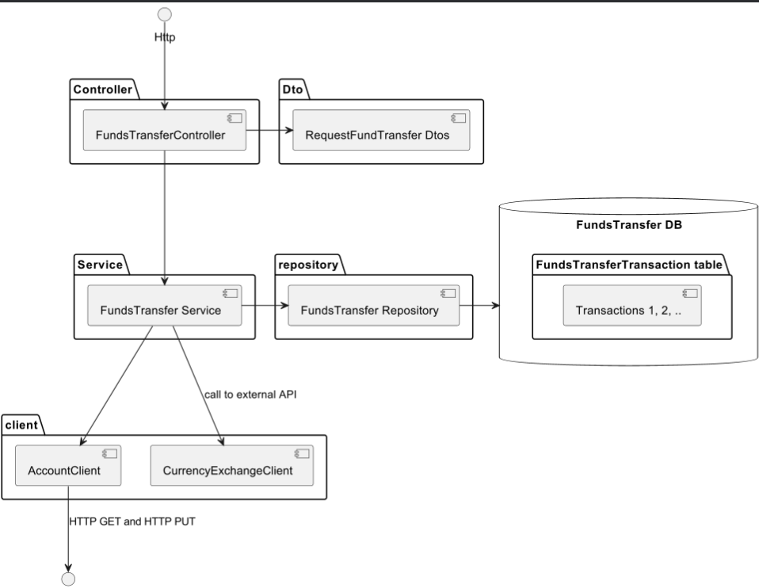
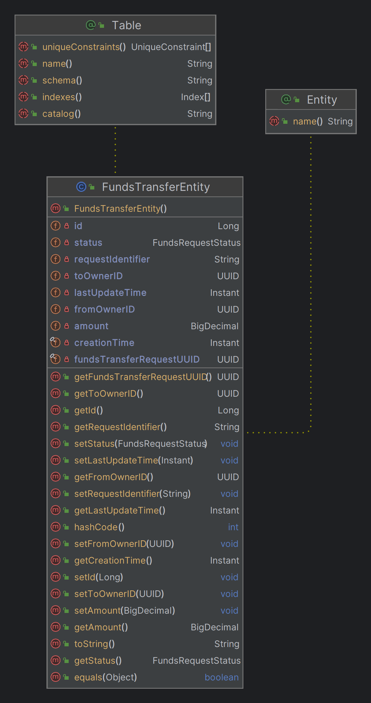
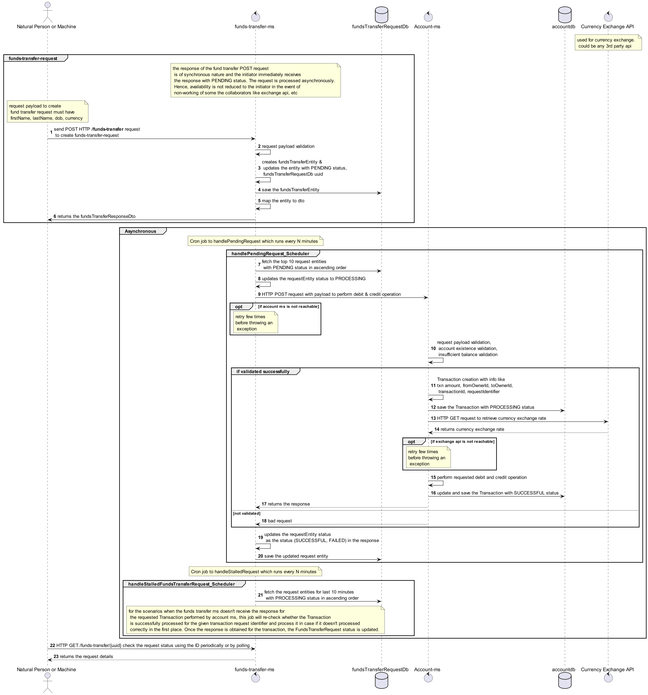
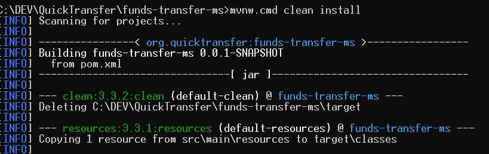
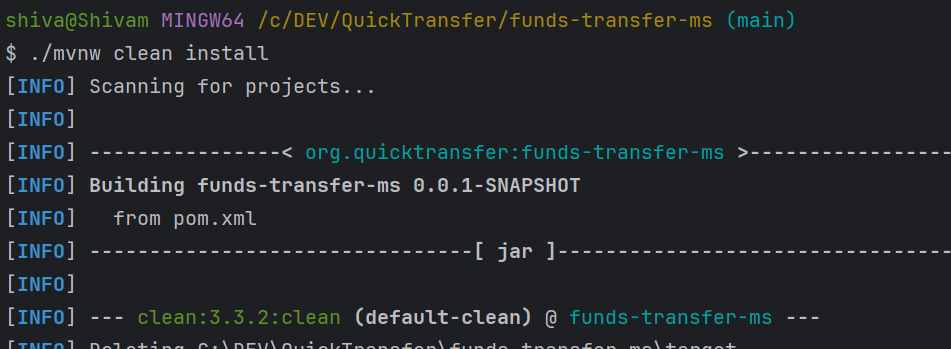
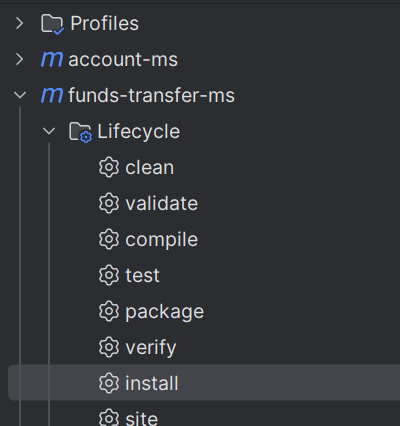
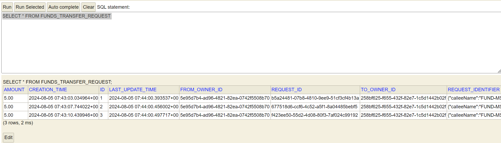

# funds-transfer-ms

[!Build Status]
[!Coverage Status]

## Table of Contents

1. #### Introduction
2. #### Project Structure & flow
3. #### Installation
4. #### Configuration
5. #### How to run?
6. #### Languages and framework
7. #### Assumptions

## Introduction

funds-transfer-ms is a one of the microservice which constitutes the Quick Transfer application.


It is a spring Boot project that implements/part of a Funds Transfer system with a well-structured flow from the controller
to the service layer, repository, and database interactions. The project also includes a scheduler to
handle pending and stalled requests and communicates with an external account service via HTTP POST.

## Project Structure & flow

### Overview



##### Controller

- FundsTransferController: Handles HTTP requests for creating fund transfer requests. It receives FundsTransferRequestDto and returns FundsTransferResponseDto.

- DTO (Data Transfer Objects)
  - FundsTransferRequestDto: Represents the data structure for incoming transfer requests.
  - FundsTransferResponseDto: Represents the data structure for the response after processing a transfer request.

##### Service
- FundsTransferService: Contains the business logic for handling fund transfer requests. It interacts with the repository to store and retrieve transfer requests.

##### Repository
- FundsTransferRepository: Manages the data access operations related to fund transfer requests. It interfaces with the database (FundsTransferRequestDB).

##### Database
- FundsTransferRequestDB: Stores transfer requests. It contains transferRequest entries, each representing a fund transfer request.

- 
##### Scheduler

- handlePendingFundsTransferRequests: Processes pending transfer requests, ensuring they are handled promptly.
- handleStalledFundsTransferRequests: Manages stalled transfer requests, attempting retries or logging issues.

##### External Client

AccountClient: Communicates with the external account service to update the request status. It uses HTTP POST to send updates to the account service.

##### Flow


## Installation

### Prerequisites

- Java 17
- Spring-Boot 3.3.2
- Maven
- git

## Configuration Steps

1. configure the jdk - 17, in case you want to use another version, please make the necessary changes to
   java.version in parent pom.xml

2. Switch to develop branch. There are a couple of feature branches starting with feature/101 too.

## How to run?

1. Clone the repo - https://github.com/Thor-TechSavy/funds-transfer-ms.git
2. Validate the application properties.
3. Build using Maven wrapper,
   For WINDOWS,
    - Ensure JAVA_HOME is set properly,
    - navigate to project directory and do 'mvnw.cmd clean install'
      

   For Bash, ./mvnw clean install
   

4. OPTIONAL -You can also build using maven plugin in the IntelliJ
   
5. Start the application - using the intelliJ or via command via bash or commandLine
6. ### Swagger Information
    - Swagger UI: http://localhost:9001/swagger-ui.html
    - OpenApi Json: http://localhost:9001/v3/api-docs
7. IN MEMORY H2 DB
    - link: http://localhost:9001/h2-console/login.jsp
    - Jdbc url: jdbc:h2:mem:fundstransferdb 
## Languages and Framework

- java 17, spring-boot, junit, jackson, slf4j, mockito

## Assumptions
 
1. the request is created with PENDING status.
2. The cron job changes the status to PROCESSING.
3. The request status is changed to SUCCESSFUL or FAILED status based upon the response of the processing in the account-ms.
4. persists the entities in in-memory h2 db.
5. The fund transfer request creation is synchronous operation to improve the response availability.
6. The end user can wait for the processing of the fund transfer request as it is handled asynchronously
7. The cron jobs uses shedlock, which ensures that only one instance of the job runs in a distributed environment at a given time.
8. Cron jobs runs every two minutes to process the pending requests once they are created.
9. Use pessimistic locking to ensure data consistency in concurrent environment.

## Tests and output

1. How to create funds transfer request?
```text

URL: POST http://localhost:9001/v1/funds-transfer
PAYLOAD:
{
  "fromOwnerId": "11111111-1111-1111-1111-000011111111",
  "toOwnerId": "11111111-1111-1111-1111-000011111111",
  "amount": 500
}

RESPONSE: 
{
  "status": "SUCCESSFUL",
  "fundsTransferRequestUUID": "3fa85f64-5717-4562-b3fc-2c963f66afa6",
  "requestIdentifier": "{\"calleeName\":\"funds-ms\",\"requestTime\":\"2024-08-02 12:00:53.010863+00\",\"transferRequestId\":\"775bbf93-8082-439e-89d5-e585224de199\"}"
}

```


2. How to fetch the funds transfer request?
```text

URL: GET http://localhost:9000/v1/funds-transfer/{{uuid}}

RESPONSE: 
{
  "status": "SUCCESSFUL",
  "fundsTransferRequestUUID": "3fa85f64-5717-4562-b3fc-2c963f66afa6",
  "requestIdentifier": "{\"calleeName\":\"funds-ms\",\"requestTime\":\"2024-08-02 12:00:53.010863+00\",\"transferRequestId\":\"775bbf93-8082-439e-89d5-e585224de199\"}"
}
```
